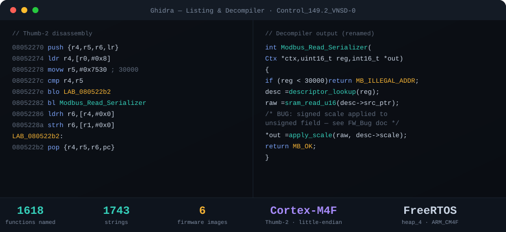
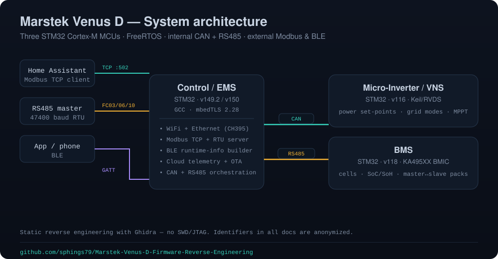
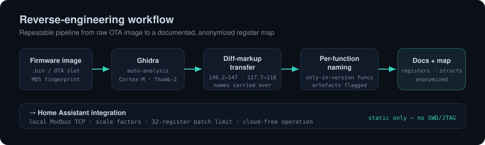
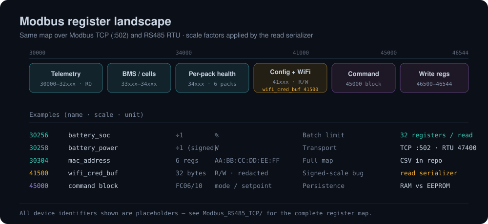
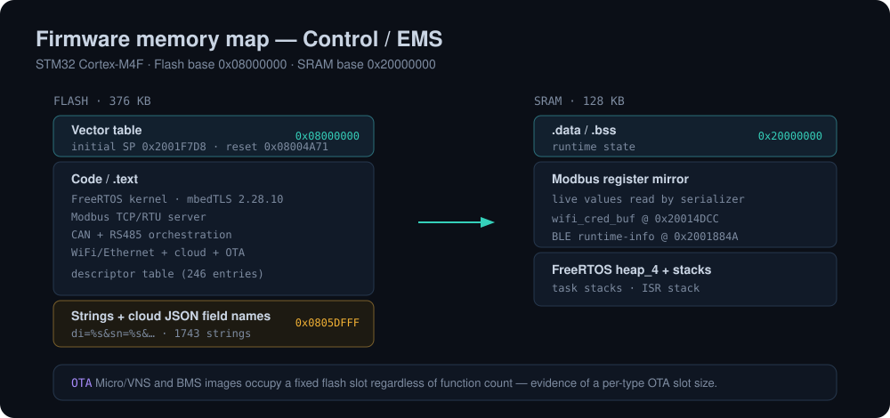

# Marstek Venus D — Firmware Reverse Engineering

**English** · [Deutsch](README.de.md)

Static reverse engineering of the **Marstek Venus D / E** battery-storage firmware — the Control/EMS
processor, the Micro-Inverter/VNS controller and the BMS — using **Ghidra**. The goal is a fully
documented, **cloud-free local Modbus TCP** interface for a **Home Assistant** integration: a complete
register map, scale factors, protocol quirks and the internal CAN/RS485 struct protocols between the
MCUs. Every finding comes from static analysis of the firmware images (no SWD/JTAG live debugging)
unless noted otherwise.

  

**Device:** Marstek Venus D/E (VNSD-0) · STM32 (STM32F3 family) · ARM Cortex-M4F · FreeRTOS
**Firmware analysed:** Control 149.2 / 150 / 147 · Micro/VNS 116 / 115 · BMS 118 / 117.7
**Keywords:** Marstek Venus firmware, Ghidra reverse engineering, STM32 Cortex-M4F, FreeRTOS, Modbus TCP,
Modbus RTU RS485, BMS, KA495XX BMIC, Home Assistant, energy storage, balcony power plant.

> [!IMPORTANT]
> All device-identifying data in this repository is **anonymized** — MAC/BT-MAC, IP addresses, device
> ID, serial number, BLE name, WiFi credentials and live credential-buffer values are replaced with
> placeholders such as `AA:BB:CC:DD:EE:FF`, `<DEVICE_ID>` or `192.168.1.100`.

## System architecture

Three STM32 MCUs cooperate over an **internal CAN bus** and **internal RS485/UART** links. The Control
processor exposes the outside world: **Modbus TCP** (WiFi via a Quectel module + Ethernet via a CH395),
a parallel **Modbus RTU** stack on external RS485, **BLE**, and the vendor cloud/OTA path.

  

> **Two meanings of “RS485”.** (1) The **external** RS485-RTU Modbus stack (47400 baud, FC03/FC06/FC10,
> the same registers as Modbus TCP) — documented in [`Modbus_RS485_TCP/`](Modbus_RS485_TCP/). (2) The
> **internal** RS485/UART links between MCUs (Control ↔ Micro-Inverter for set-points/modes; BMS
> master ↔ slave packs for 96-byte struct transfers) — a proprietary struct protocol, **not Modbus**,
> documented in [`Control_FW/`](Control_FW/) and [`BMS/`](BMS/).

## Binary fingerprint

Verified live from Ghidra. The “functions named” share is Ghidra’s symbol status. BMS 118 and Control
147 were fully re-derived by diff-markup transfer from the adjacent version plus per-function analysis
of the only-in-version functions.

| Firmware | Version | Size | Flash range | Initial SP | Reset handler | Functions (named/total) | Strings |
|---|---|---|---|---|---|---|---|
| Control | **149.2 (current)** | 385,024 B (376 KB) | `0x08000000–0x0805DFFF` | `0x2001F7D8` | `0x08004A71` | 1618 / 1622 (99.8 %) | 1743 |
| Control | 147 | 372,736 B (364 KB) | `0x08000000–0x0805AFFF` | `0x2001F3E0` | `0x08004A71` | 1870 / 1870 (100 %) | 1302 |
| Micro/VNS | **116 (current)** | 115,712 B (113 KB) | `0x08000000–0x0801C3FF` | `0x20009A70` | `0x080042AD` | 392 / 445 (88.1 %) | 251 |
| Micro/VNS | 115 | 115,712 B (113 KB) | `0x08000000–0x0801C3FF` | `0x20009A70` | `0x080042B1` | 13 / 190 (version diff only) | 102 |
| BMS | **118 (current)** | 106,496 B (104 KB) | `0x08000000–0x08019FFF` | `0x2000CBA0` | `0x08002A6D` | 550 / 550 (100 %) | 256 |
| BMS | 117.7 | 106,496 B (104 KB) | `0x08000000–0x08019FFF` | `0x2000CB90` | `0x08002A6D` | 552 / 552 (100 %) | 260 |

**Shared by all six images:** ARM Cortex-M4F, Thumb-2, little-endian, FreeRTOS (`heap_4`, `ARM_CM4F`
port), flash base `0x08000000`.

| Firmware | Compiler | Crypto | Cell monitoring | Communication |
|---|---|---|---|---|
| Control | GCC | mbedTLS 2.28.10 | — | WiFi + Ethernet (CH395) + RS485 + CAN |
| Micro/VNS | RVDS/Keil ARM | — | — | CAN + RS485 |
| BMS | RVDS/Keil ARM | — | KA495XX (BMIC) | CAN + RS485 |

Notably, Micro/VNS 115↔116 and BMS 117.7↔118 occupy the exact same flash range despite different
function counts — evidence of a fixed OTA slot size per firmware type.

## Reverse-engineering workflow

  

The methodology, Ghidra lessons learned and the firmware-diff workflow are in
[`Methodik_und_Meta/`](Methodik_und_Meta/).

## Repository layout

| Folder | Contents |
|---|---|
| [`Control_FW/`](Control_FW/) | Control/EMS firmware (main processor): full function analysis for v149.2 and v147, plus the v150 cloud watchdog and the root-cause case study of the 30-minute network dropouts |
| [`VNS_Micro_Inverter/`](VNS_Micro_Inverter/) | Micro-Inverter/VNS firmware: function analysis, register maps, error codes, 115→116 version diff |
| [`BMS/`](BMS/) | BMS firmware analysis (v117.7, v118) and a per-pack fault case study |
| [`Modbus_RS485_TCP/`](Modbus_RS485_TCP/) | External Modbus interface (TCP **and** RS485 RTU): connection reference, protocol quirks, scale factors, the complete register map (CSV), descriptor-table format, raw scan logs, the read-serializer sign bug, write-register block 46500–46544 |
| [`CAN_Bus/`](CAN_Bus/) | Internal CAN bus between the MCUs: arbitration-ID layout, target classes, function-code tables for all 46 Control send-sites vs. the Micro v116 and BMS v118 dispatchers |
| [`BLE/`](BLE/) | BLE command map and BLE↔Modbus cross-reference |
| [`HM_HIE_FC41D/`](HM_HIE_FC41D/) | FC41D WiFi/BLE comms module: OTA analysis, Hamedata app API recon, traffic-capture guides (binaries excluded) |
| [`Scripts/`](Scripts/) | Python tools to scan/monitor the Modbus registers (raw socket, no pymodbus) and the decompilation exporter |
| [`Methodik_und_Meta/`](Methodik_und_Meta/) | Reverse-engineering methodology, Ghidra workflow, firmware-diff workflow, serial-number format, open questions |

## Modbus register map

The same register map is reachable over Modbus **TCP** (`:502`) and **RS485 RTU** (47400 baud). The read
serializer applies per-register scale factors; reads are limited to **32 registers per request**.

  

The complete map lives in [`Modbus_RS485_TCP/`](Modbus_RS485_TCP/) as CSV plus Markdown notes, together
with the scan logs across charge/discharge/backup/DoD states.

## Firmware memory map

  

## Security findings

During the analysis, security-relevant findings were made — among them a product-line-wide, hard-coded
AWS-IoT client certificate with its private key, and a firmware-update path without a bounds check.
These were reported to the vendor via **responsible disclosure** and are **deliberately not published
here** until a fix is available. Affected passages in the documents point to internal, non-public notes.

## Using this for a Home Assistant integration

The most relevant material is in [`Modbus_RS485_TCP/`](Modbus_RS485_TCP/) (connection setup, register
map, scale factors, the 32-register batch limit) together with the register/struct descriptions in
[`Control_FW/`](Control_FW/) and [`VNS_Micro_Inverter/`](VNS_Micro_Inverter/). Running the device
cloud-free avoids the firmware’s 30-minute network resets — see the related projects below.

## Related Marstek projects

| Project | What it is |
|---|---|
| [marstek_venus_modbus_dev](https://github.com/sphings79/marstek_venus_modbus_dev) | Home Assistant integration for Marstek Venus over local Modbus TCP — sensors, controls, schedules, full register map. No cloud, HACS compatible. |
| [Marstek-offline-endpoint](https://github.com/sphings79/Marstek-offline-endpoint) | Self-hosted endpoint that answers the telemetry upload locally, stopping the firmware’s 30-minute network resets that break Modbus TCP. |
| [Marstek_Modbus_Register](https://github.com/sphings79/Marstek_Modbus_Register) | Community reverse-engineering of the Venus D Modbus TCP registers (30000–49999), DE/EN, CSV + Markdown. |
| [marstek-firmware-archiv](https://github.com/sphings79/marstek-firmware-archiv) | Firmware archive for Venus E/D/A, Saturn/B2500 & CT002 — original OTA downloads, release notes, SHA-256 checksums. |
| [marstek-fw-checker](https://github.com/sphings79/marstek-fw-checker) | Download, back up & archive firmware for Marstek Venus D/E/C/A and B2500 before installing an update. |
| [marstek-firmware-analyzer](https://github.com/sphings79/marstek-firmware-analyzer) | Browser-based analyzer for Marstek firmware images — extracts embedded certificates, keys and AWS IoT endpoints, fully client-side. |
| [venuscontrol](https://github.com/sphings79/venuscontrol) | Cloud-free web control panel for Venus A/D over Web Bluetooth — OTA updates, peak shaving, local Modbus TCP / Shelly Pro 3EM setup. |

## Disclaimer

Independent research for interoperability and security. Not affiliated with or endorsed by Marstek.
All trademarks belong to their respective owners. Firmware images and decompilation output are **not**
redistributed here.
